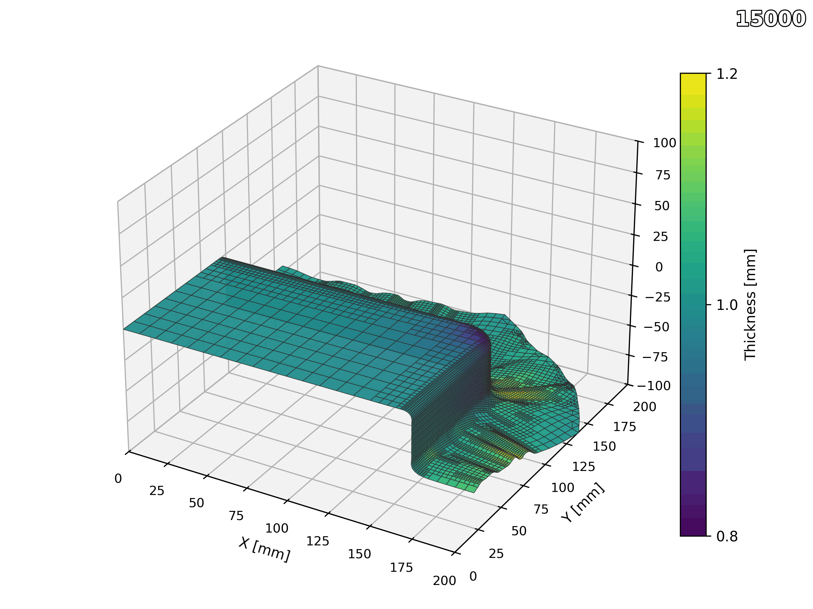

# 🧠 DeepDrawing Dataset  
*A Data-Driven Dataset for Automated Deep Drawing Tool Design*

This repository provides a dataset for **data-driven tool surface generation** in deep drawing,  
based on the publication:

> **M. Hohmann, A. Yiming, L. Penter, S. Ihlenfeldt, O. Niggemann**  
> *A Data-Driven Approach for Automating the Design Process of Deep Drawing Tools*  
> *Journal of Physics: Conference Series*, Vol. 3104, 012061 (2025).  
> DOI: [10.1088/1742-6596/3104/1/012061](https://doi.org/10.1088/1742-6596/3104/1/012061)

---

## 📖 Overview

This dataset enables research on **automated tool design** using **generative neural networks**.  
It provides both **deep drawn part geometries** (input) and **active tool surfaces** (output)  
for **dies** and **punches**, along with the associated process parameters.

| Component | Description |
|------------|-------------|
| **Deep Drawn Parts** | 3D point clouds derived from LS-Dyna simulations |
| **Tool Geometries** | Active surfaces of die and punch tools |
| **Process Parameters** | Blankholder force and five geometric parameters |
| **Simulation Metadata** | FE setup, material model, and part quality classification |

---

## ⚙️ Data Generation Pipeline

Data was generated through an **automated FE-simulation workflow** combining  
[Gmsh](https://gmsh.info/) and **LS-Dyna**, with custom Python scripts for preprocessing.

**Workflow Summary**
1. Parameterize tool geometry (R1, R2, h, c, α).
2. Generate and mesh geometries using Gmsh.
3. Run LS-Dyna forming simulations with varying `FBH`.
4. Extract part meshes and tool surfaces.
5. Convert results into `.xls`, `.pt`, or `.h5` for ML training.


---

## 📊 Parameter Overview

| Parameter | Symbol | Range | Unit | Description |
|------------|---------|--------|------|-------------|
| Corner radius | R1 | 5 – 8 | mm | Outer corner of die/punch |
| Fillet radius | R2 | 20 – 55 | mm | Transition curvature |
| Drawing depth | h | 25 – 50 | mm | Height of part cavity |
| Clearance | c | 1.1 – 1.4 | mm | Gap between die & punch |
| Bevel angle | α | 0 – 10 | ° | Conical wall inclination |
| Blankholder force | FBH | 15 – 40 | kN | Process pressure |

**Simulations performed:** 2,048  
**Unique tool geometries:** 228  

---

## 🧩 Data Format

Each dataset sample consists of:

```python
{
    "part": Tensor[N, 3],        # Deep drawn part (normalized)
    "die": Tensor[N, 3],         # Die active surface
    "punch": Tensor[N, 3],       # Punch active surface
    "params": {
        "R1": float,
        "R2": float,
        "h": float,
        "c": float,
        "alpha": float,
        "FBH": float
    },
    "condition": [1, 0] or [0, 1]  # One-hot for die/punch
}